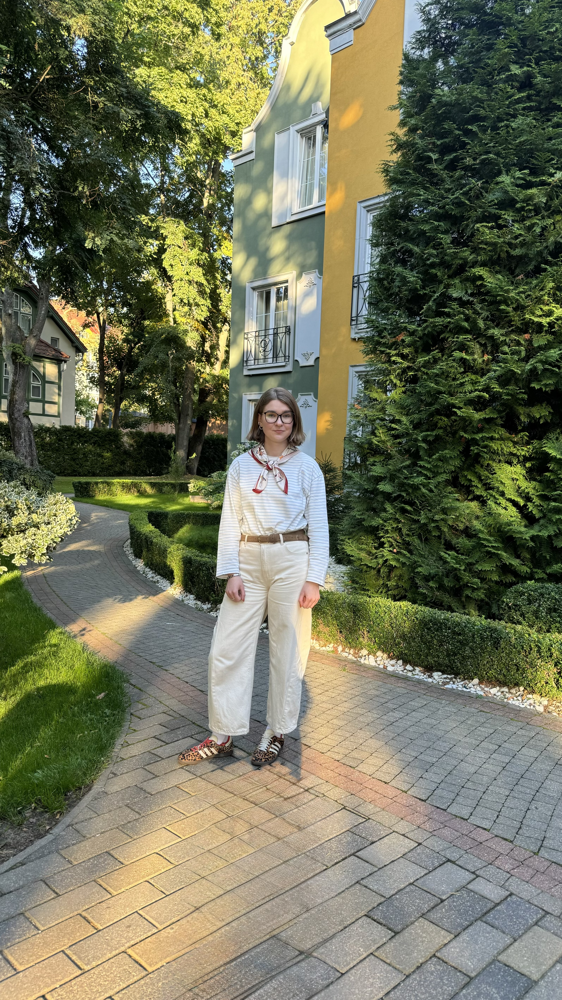

# Мария Лампадова

  

Привет! Это мой небольшой персональный сайт — место, где я собрала информацию о себе, учебных проектах и вещах, которыми мне интересно заниматься.

Сейчас я учусь в Университете ИТМО и постепенно разбираюсь в том, как устроены цифровые продукты: от идеи и структуры до технической реализации.

## Чем я занимаюсь сейчас

Последнее время в моём учебном списке были:

- Git и GitHub;
- Docker и контейнеризация;
- CI/CD и GitHub Actions;
- мониторинг с Prometheus и Grafana;
- Markdown и MkDocs.

Мне нравится разбираться не только в том, **как работает инструмент**, но и зачем он нужен и как вписывается в общий процесс создания продукта.

## Этот сайт

Здесь есть несколько разделов:

1. [О себе](about.md) — немного больше обо мне, учёбе и интересах.
2. [Проекты](projects.md) — работы, которые я делала в рамках курса.
3. [Контакты](contacts.md) — способы связаться со мной.

> Этот сайт тоже является частью учебного проекта: он собран с помощью MkDocs и оформлен в Markdown.
